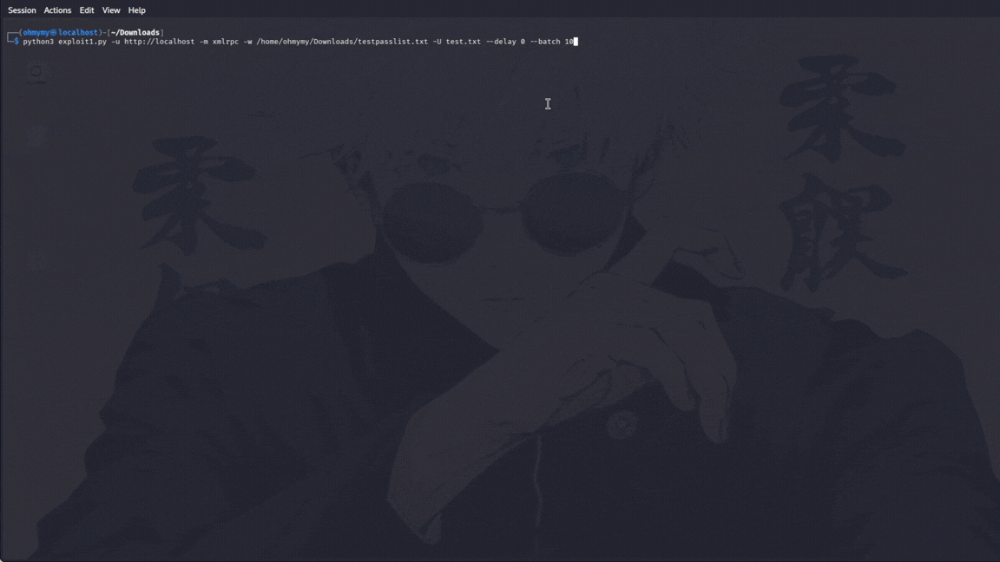

# WordPress Website Testing Tool
**Version: 1.0 — Author: Mr.valentine (NAYAN) "don't miind the name "**




---


```
 ██     ██ ██████  ██       ██████   ██████  ██████   ██████  ███████ ███████ 
 ██     ██ ██   ██ ██      ██    ██ ██       ██   ██ ██    ██ ██      ██      
 ██  █  ██ ██████  ██      ██    ██ ██   ███ ██████  ██    ██ ███████ █████   
 ██ ███ ██ ██      ██      ██    ██ ██    ██ ██      ██    ██      ██ ██      
  ███ ███  ██      ███████  ██████   ██████  ██       ██████  ███████ ███████
    WordPress Testing Toolkit
    by  Mr.valentine(NAYAN)
    For details visit:                ver: 1.0
```

**Authorized security testing tool for WordPress websites.**  
This toolkit helps penetration testers and site owners identify weak credentials through multiple attack vectors, user enumeration, and intelligent success detection.

[](https://www.python.org/downloads/)
[](https://opensource.org/licenses/MIT)
[]()

---

## 📖 Table of Contents
- [Features](#features)
- [Requirements](#requirements)
- [Installation](#installation)
- [Usage](#usage)
- [Attack Modes](#attack-modes)
- [Examples](#examples)
- [Configuration Summary UI](#configuration-summary-ui)
- [How It Works](#how-it-works)
- [Batch Size Limits](#batch-size-limits)
- [Legal Disclaimer](#legal-disclaimer)
- [Credits](#credits)

---

## ✨ Features

- **User Enumeration** – Discover WordPress usernames via:
  - REST API (`/wp-json/wp/v2/users`)
  - Author archives (`/?author=1`, `/?author=2`, …)
  - oEmbed endpoint (`/wp-json/oembed/1.0/embed`)

- **Multiple Attack Vectors**
  - `xmlrpc` – Amplified brute‑force using `system.multicall`
  - `wplogin` – Traditional POST‑based attack on `wp-login.php`
  - `restapi` – HTTP Basic Auth against the REST API
  - `all` – Try all methods sequentially

- **Smart XML‑RPC Detection** – Looks for `<blogid>` in the response – the most reliable indicator of a successful login.

- **Proxy Support** – HTTP, HTTPS, and SOCKS (e.g., Tor) proxies.

- **Progress Feedback** – Batch messages for XML‑RPC; every‑10‑attempts progress for other modes.

- **Connectivity Test** – Verifies XML‑RPC is alive before attacking.

- **Resume Capability** – Track tested passwords with `--resume`.

- **Custom User‑Agents** – Rotate realistic browser agents or supply your own list.

- **Output Saving** – Append found credentials to a file.

- **Configuration Summary UI** – Clean, colorful table showing all settings before starting.

---

## 📦 Requirements

- Python 3.6 or higher
- `requests` library

### Installing `requests`

```bash
pip install requests
```

**For Kali Linux (2024.4+):**  
Use `pipx` or a virtual environment (see [Kali’s Python documentation](https://www.kali.org/docs/general-use/python3-external-packages/)).

---

## 🔧 Installation

1. **Clone the repository** (or download the script directly):
   ```bash
   git clone https://github.com/yourusername/wordpress-testing-toolkit.git
   cd wordpress-testing-toolkit
   ```

2. **Make the script executable** (optional):
   ```bash
   chmod +x wp_toolkit.py
   ```

3. **Install dependencies** (if not already done).

---

## 🚀 Usage

```bash
python3 wp_toolkit.py -u <URL> -m <mode> [options]
```

### Required Arguments

| Short | Long      | Description                          |
|-------|-----------|--------------------------------------|
| `-u`  | `--url`   | Target WordPress URL (e.g., `https://example.com`) |

### Optional Arguments

| Short | Long            | Description                                      | Default     |
|-------|-----------------|--------------------------------------------------|-------------|
| `-w`  | `--wordlist`    | Password wordlist file (required for brute‑force) | –           |
| `-U`  | `--usernames`   | Username list file (one per line)                 | None (will enumerate) |
| `-m`  | `--mode`        | Attack mode: `enumerate`, `xmlrpc`, `wplogin`, `restapi`, `all` | `enumerate` |
|       | `--proxy`       | Proxy URL (e.g., `socks5h://localhost:9050`)      | None        |
| `-t`  | `--threads`     | Number of threads (use with caution)               | `1`         |
|       | `--delay`       | Delay between requests (seconds)                   | `1.0`       |
|       | `--batch`       | Passwords per XML‑RPC multicall request            | `20`        |
|       | `--timeout`     | Request timeout (seconds)                          | `15`        |
|       | `--output`      | File to append found credentials                    | None        |
|       | `--resume`      | File to store/check tested passwords (for resuming)| None        |
|       | `--user-agents` | Custom User‑Agent file (one per line)              | Built‑in list |
|       | `--no-banner`   | Suppress the ASCII banner                           | `False`     |

---

## 🎯 Attack Modes

| Mode        | Description                                                                 |
|-------------|-----------------------------------------------------------------------------|
| `enumerate` | Discover usernames (saves to `users.txt`) – no login attempts.              |
| `xmlrpc`    | Use XML‑RPC `system.multicall` to test many passwords per request.          |
| `wplogin`   | Traditional POST brute‑force against `wp-login.php`.                        |
| `restapi`   | HTTP Basic Auth against `/wp-json/wp/v2/users/me`.                          |
| `all`       | Run `xmlrpc` → `wplogin` → `restapi` for each username until success.      |

---

## 📚 Examples

### 1. Enumerate users
```bash
python3 wp_toolkit.py -u https://example.com -m enumerate
```

### 2. XML‑RPC brute‑force with Tor proxy
```bash
python3 wp_toolkit.py -u https://example.com -m xmlrpc -w rockyou.txt -U users.txt --proxy socks5h://localhost:9050 --delay 2 --batch 10 --timeout 30
```

### 3. wp‑login.php attack (local test, no proxy)
```bash
python3 wp_toolkit.py -u http://localhost -m wplogin -w passwords.txt -U admin.txt --delay 1
```

### 4. All methods sequentially with output file
```bash
python3 wp_toolkit.py -u https://example.com -m all -w common.txt -U users.txt --output found.txt
```

### 5. Custom User‑Agent file
Create `my_agents.txt` with one agent per line, then:
```bash
python3 wp_toolkit.py -u https://example.com -m xmlrpc -w list.txt -U users.txt --user-agents my_agents.txt
```

---

## 🎨 Configuration Summary UI

Before any attack, the script displays a beautiful summary table with your settings, e.g.:

```
────────────────────────────────────────────────────────────────────────────────
  🎯  Target URL          │ http://localhost
  🚩  In-Scope URL        │ localhost
  📖  Wordlist            │ /home/user/passwords.txt
  👤  Usernames file      │ users.txt
  🚀  Mode                │ xmlrpc
  🔗  Proxy                │ socks5h://localhost:9050
  ⚙️   Threads             │ 1
  ⏱️   Delay (sec)         │ 2.0
  📦  Batch size (XMLRPC) │ 10
  ⏳  Timeout (sec)       │ 30
  💾  Output file         │ found.txt
  🔄  Resume file         │ None
  🦡  User-Agent          │ Random (built-in)
  📂  Users loaded        │ 1
────────────────────────────────────────────────────────────────────────────────
```

---

## 🔍 How It Works

### User Enumeration
- **REST API**: Requests `/wp-json/wp/v2/users` and extracts `slug` fields.
- **Author archives**: Sends requests to `/?author=1`, `/?author=2`, etc. and follows redirects to `/author/username/`.
- **oEmbed**: Fetches `author_name` from `/wp-json/oembed/1.0/embed`.

### XML‑RPC Multicall Attack
- Passwords are grouped into batches (size = `--batch`).
- Each batch is sent as one `system.multicall` request containing multiple `wp.getUsersBlogs` calls.
- The server returns an array of responses.
- `_check_xmlrpc_success()` iterates through each response:
  - Skips any `<value>` that contains a `<fault>` (failed login).
  - Looks for a member `<name>` equal to `blogid`. If found, that password succeeded.

Why `<blogid>`? It is **always** present in a successful `wp.getUsersBlogs` response and never in a fault, making it a perfect success indicator.

### wp‑login.php Attack
- Sends POST data with `log`, `pwd`, `wp-submit`, `redirect_to`, `testcookie`.
- Success is detected when the response does **not** contain `login_error` and the URL contains `wp-admin`.

### REST API Attack
- Uses HTTP Basic Authentication on `/wp-json/wp/v2/users/me`.
- A `200 OK` response indicates valid credentials.

---

## ⚠️ Batch Size Limits

WordPress servers often limit the number of nested calls in a `system.multicall` request. If `--batch` exceeds this limit:
- The server may return a **top‑level `<fault>`** (script skips the entire batch).
- Or return an array where **every inner `<value>` is a `<fault>`** (script finds no success).

**Always find the maximum working batch size for your target** by testing with a small wordlist containing a known‑good password. Start with `--batch 5` and increase until success stops appearing.

---

## 🐞 Troubleshooting

| Issue                          | Solution                                                                 |
|--------------------------------|--------------------------------------------------------------------------|
| No users found                 | Use a manual username list with `-U`.                                    |
| XML‑RPC fails with larger batches | Reduce `--batch`.                                                        |
| Proxy connection refused       | Ensure Tor/proxy is running; verify URL (e.g., `socks5h://localhost:9050`). |
| `requests` module not found    | Install it: `pip install requests` (or use `pipx`/venv on Kali).        |
| Script hangs                   | Press `Ctrl+C` to see traceback; check network/proxy.                   |
| False positives                | Enable debug prints in `_check_xmlrpc_success()` to inspect raw XML.    |

---


## Safety & legal

This tool is for **authorized security testing only**. Do not run it against systems you do not own or have explicit permission to test. I’m not responsible for misuse.

---
📜 License

This project is licensed under the [MIT License](LICENSE). Feel free to use, modify, and distribute it as needed.

